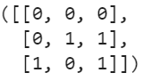
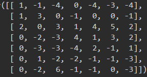
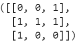
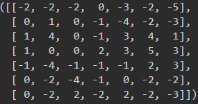

# Feb26Response

## Convolve the two 3x3 matrices that were assigned to you with your 9x9 matrix and calculate the resulting two matrices

Original Matrix 
<code> [[ 0,  0, -1,  0,  0,  2,  1,  0, -1],
       [-1,  0,  0, -2, -1,  0, -1, -1, -1],
       [ 0,  0,  1,  1, -2,  0, -1, -1, -1],
       [-1,  1,  1,  0,  0,  1,  1,  1,  0],
       [-1,  1,  1, -2,  2,  2,  0,  1,  1],
       [-1,  0, -1, -1, -2,  1,  1,  1, -1],
       [ 0,  0,  1, -1, -1, -2,  1, -1,  0],
       [ 0, -1, -1,  2,  1, -1, -1,  0, -1],
       [ 1, -1,  1, -2,  2,  1, -1,  0, -1]] </code>

Kernel1

Kernel1 convolved over matrix output

Kernel2

Kernel2 convolved over matrix output

## What is the purpose of using a 3x3 filter to convolve across a 2D image matrix?

## Why would we include more than one filter? How many filters did you assign as part of your architecture when training a model to learn images of numbers from the mnist dataset?

## MSE: From your 400+ observations of homes for sale, calculate the MSE for the following.
The 10 biggest over-predictions
The 10 biggest under-predictions
The 10 most accurate results (use absolute value)

## In which percentile do the 10 most accurate predictions reside? Did your model trend towards over or under predicting home values?
## Which feature appears to be the most significant predictor in the above cases?
## Stretch goal: calculate the MAE and compare with your MSE results
